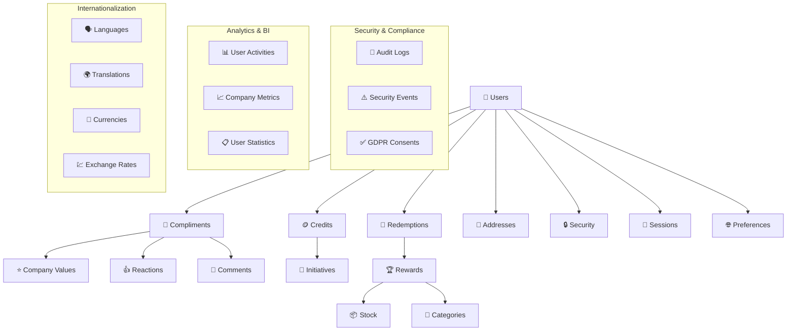

# Valorize Platform - Database Migration Guide
## 5-Phase Implementation Strategy for Enterprise-Grade Culture Platform

### 🎯 Executive Summary

This guide outlines the complete database migration strategy for the Valorize platform, a B2B corporate culture and engagement system. The database is designed following **Clean Architecture principles** and implements a **5-phase progressive migration** approach to minimize risk and ensure system reliability.

**Platform Overview:**
- **System Type**: B2B Corporate Culture & Engagement Platform
- **Architecture**: Monolithic Modular with Clean Architecture
- **Database**: PostgreSQL with advanced features (JSONB, Full-text search, Materialized views)
- **Compliance**: GDPR, SOX, Enterprise Security Standards
- **Scale**: Designed for 10,000+ users per organization
- **Languages**: Multi-language support (8 languages initially)
- **Security**: Enterprise-grade with MFA, audit logging, encryption

---

## 📋 Migration Overview

### Implementation Philosophy
- **Progressive Enhancement**: Each phase adds functionality without breaking previous phases
- **Clean Architecture**: Clear separation of concerns with Domain → Application → Infrastructure → Presentation layers
- **Risk Mitigation**: Independent phases allow for rollback and gradual deployment
- **Performance First**: Strategic indexing and optimization at each phase
- **Compliance Ready**: Security and audit features built-in from the start

### Phase Dependencies
```
Phase 1 (Core Tables) 
    ↓
Phase 2 (Business Logic) 
    ↓
Phase 3 (Security & Compliance) 
    ↓
Phase 4 (Internationalization) 
    ↓
Phase 5 (Analytics & Advanced Features)
```

---

## 🏗️ Phase 1: Core Tables (`01_core_tables.sql`)

### **Purpose**: Foundation & Essential Business Operations
**Deployment Priority**: CRITICAL - Must be deployed first
**Estimated Execution Time**: 5-10 minutes
**Database Size Impact**: ~50MB initial schema

### Core Components

#### 1. User Management System
```sql
Tables: user, address, user_security (basic)
Features: Basic authentication, profile management, address handling
```

**Why First?**: Every other system component depends on user identity and authentication.

**Business Value**:
- Users can register and manage profiles
- Address management for reward shipping
- Basic security foundation

#### 2. Gamification Core
```sql
Tables: initiatives, credits, compliment
Features: Peer recognition, company initiatives, coin system
```

**Why Essential**: Core business logic for culture building and peer recognition.

**Business Value**:
- Employees can send compliments with company values
- Track participation in company initiatives
- Basic gamification with virtual coins

#### 3. Rewards System
```sql
Tables: rewards, stock, redeem
Features: Reward catalog, inventory management, redemption tracking
```

**Business Value**:
- Complete reward marketplace functionality
- Inventory and stock management
- Order fulfillment tracking

#### 4. Admin Foundation
```sql
Tables: admin_roles, admin_permissions, permissions_to_roles, admin_users
Features: Role-based access control (RBAC)
```

**Business Value**:
- Secure administrative access
- Granular permission system
- Multi-level admin hierarchy

### Key Indexes & Constraints
- **Performance**: 25+ strategic indexes for common queries
- **Data Integrity**: Foreign keys, check constraints, unique constraints
- **Business Rules**: Self-compliment prevention, default address logic

### Success Criteria for Phase 1
- [ ] All tables created without errors
- [ ] Foreign key relationships established
- [ ] Basic CRUD operations functional
- [ ] Admin system operational
- [ ] Sample data can be inserted successfully

---

## 🎯 Phase 2: Business Logic Enhancement (`02_business_logic.sql`)

### **Purpose**: Advanced Features & Social Engagement
**Deployment Priority**: HIGH - Significantly enhances platform value
**Estimated Execution Time**: 10-15 minutes
**Database Size Impact**: ~100MB additional

### Advanced Components

#### 1. Structured Company Values System
```sql
Tables: company_values, company_values_i18n (preparation)
Features: Hierarchical company values with UI theming
```

**Enhancement Over Phase 1**: Replaces varchar company_value with structured, themeable system.

**Business Value**:
- Consistent company value representation
- UI theming and branding support
- Better analytics and reporting

#### 2. Advanced Coin Transaction System
```sql
Tables: coin_transactions
Features: Complete audit trail, balance tracking, transaction history
```

**Business Value**:
- Full financial audit trail for virtual currency
- Balance verification and fraud prevention
- Detailed transaction analytics

#### 3. Social Engagement Features
```sql
Tables: compliment_reactions, compliment_comments
Features: Like/react to compliments, comment threads
```

**Business Value**:
- Increased platform engagement
- Social validation and recognition amplification
- Community building features

#### 4. Enhanced Reward System
```sql
Tables: reward_categories (hierarchical), reward_wishlist, initiative_participants
Features: Category hierarchy, user wishlists, initiative tracking
```

**Business Value**:
- Better reward organization and discovery
- Personalized user experience
- Enhanced initiative management

#### 5. Notification Foundation
```sql
Tables: notifications
Features: In-app notification system
```

**Business Value**:
- Real-time user engagement
- Important update delivery
- Customizable notification preferences

### Business Intelligence Foundations
- **Materialized Views**: Pre-calculated statistics for performance
- **Performance Views**: User dashboard optimization
- **Business Logic Validation**: Complex constraints and rules

### Success Criteria for Phase 2
- [ ] Social features functional (reactions, comments)
- [ ] Advanced coin system operational
- [ ] Notification system working
- [ ] Hierarchical reward categories functional
- [ ] Performance views providing expected data

---

## 🔒 Phase 3: Security & Compliance (`03_security_compliance.sql`)

### **Purpose**: Enterprise Security & Regulatory Compliance
**Deployment Priority**: CRITICAL for Production
**Estimated Execution Time**: 15-20 minutes
**Database Size Impact**: ~150MB additional (mainly audit logs)

### Security Infrastructure

#### 1. Advanced User Security
```sql
Tables: user_security (enhanced), rate_limits
Features: MFA, account lockout, login tracking, rate limiting
```

**Security Benefits**:
- Multi-factor authentication support
- Brute force attack prevention
- Comprehensive login monitoring
- Account lockout mechanisms

#### 2. Comprehensive Audit System
```sql
Tables: audit_logs, security_events
Features: GDPR/SOX compliance, security monitoring
```

**Compliance Value**:
- Complete audit trail for regulatory compliance
- Security incident tracking and response
- Data change history for legal requirements
- Automated threat detection

#### 3. Data Protection & Privacy
```sql
Tables: user_consents, encrypted_personal_data, data_retention_policies
Features: GDPR consent management, data encryption, retention policies
```

**Privacy Compliance**:
- GDPR Article 6 & 7 consent management
- Right to be forgotten (soft deletes)
- Data encryption for sensitive information
- Automated data retention and cleanup

#### 4. Session Management
```sql
Tables: user_sessions
Features: Secure session tracking, device fingerprinting
```

**Security Features**:
- Session hijacking prevention
- Device-based security monitoring
- Suspicious activity detection
- Centralized session management

### Security Functions & Utilities
- **Login Attempt Tracking**: Automated lockout and monitoring
- **Security Event Creation**: Automated threat response
- **Data Encryption**: Utility functions for sensitive data
- **Audit Logging**: Automated compliance logging

### Success Criteria for Phase 3
- [ ] MFA system functional
- [ ] Audit logging capturing all changes
- [ ] GDPR consent system operational
- [ ] Session security working properly
- [ ] Security monitoring active

---

## 🌍 Phase 4: Internationalization (`04_internationalization.sql`)

### **Purpose**: Global Platform Support & Localization
**Deployment Priority**: MEDIUM - Required for international deployment
**Estimated Execution Time**: 12-18 minutes
**Database Size Impact**: ~200MB additional (translations and localized content)

### Internationalization Infrastructure

#### 1. Language & Cultural Support
```sql
Tables: languages, currencies, exchange_rates
Features: Multi-language support, currency handling, cultural settings
```

**Global Support**:
- 8 languages initially (English, Portuguese, Spanish, French, German, Japanese, Chinese, Arabic)
- RTL language support (Arabic)
- Cultural number and date formatting
- Multi-currency with exchange rates

#### 2. User Localization Preferences
```sql
Tables: user_preferences (enhanced)
Features: Language, timezone, currency, format preferences
```

**User Experience**:
- Personalized language settings
- Timezone-aware displays
- Currency preference for rewards
- Cultural formatting (dates, numbers)

#### 3. Localized Content System
```sql
Tables: initiatives_i18n, rewards_i18n, company_values_i18n, reward_categories_i18n
Features: Multi-language content management
```

**Content Management**:
- Fallback to default language
- Seamless content switching
- Translator-friendly structure
- Version control for translations

#### 4. Multi-Currency Pricing
```sql
Tables: reward_pricing, system_translations
Features: Currency-specific pricing, UI translations
```

**Business Value**:
- Global market support
- Local pricing strategies
- Complete UI localization
- Cultural sensitivity

### Localization Utilities
- **Timezone Functions**: User-specific time display
- **Currency Formatting**: Locale-aware currency display
- **Translation Management**: System message handling
- **Localized Views**: Language-aware data access

### Success Criteria for Phase 4
- [ ] Multiple languages functional
- [ ] Currency conversion working
- [ ] Localized content displaying correctly
- [ ] Timezone handling accurate
- [ ] Cultural formatting applied

---

## 📊 Phase 5: Analytics & Advanced Features (`05_analytics_advanced.sql`)

### **Purpose**: Business Intelligence & System Optimization
**Deployment Priority**: MEDIUM - Enhances platform value significantly
**Estimated Execution Time**: 20-25 minutes
**Database Size Impact**: ~300MB additional (analytics data and indexes)

### Analytics Infrastructure

#### 1. User Activity Tracking
```sql
Tables: user_activities, user_behavior_patterns, user_statistics
Features: Comprehensive behavior analytics, engagement tracking
```

**Business Intelligence**:
- Complete user journey tracking
- Behavioral pattern recognition
- Engagement score calculation
- Personalization foundation

#### 2. Business Metrics System
```sql
Tables: company_metrics, search_queries, filter_presets
Features: KPI tracking, search analytics, user preferences
```

**Strategic Value**:
- Real-time business metrics
- Search behavior analysis
- User preference learning
- Performance optimization data

#### 3. Advanced Search Engine
```sql
Tables: search_indexes, search_queries
Features: Full-text search, search analytics, personalization
```

**User Experience**:
- Fast, relevant search results
- Multi-language search support
- Search history and suggestions
- Personalized result ranking

#### 4. Performance Optimization
```sql
Materialized Views: mv_user_dashboard_stats, mv_company_analytics
Features: Pre-calculated dashboards, performance monitoring
```

**Performance Benefits**:
- Sub-second dashboard loading
- Real-time analytics without performance impact
- Automated data aggregation
- Optimized reporting queries

### System Maintenance & Monitoring
- **Health Checking**: Automated system monitoring
- **Data Cleanup**: Retention policy enforcement
- **Performance Logging**: Query optimization data
- **Analytics Refresh**: Automated view updates

### Success Criteria for Phase 5
- [ ] User analytics capturing data
- [ ] Search engine functional
- [ ] Dashboard performance optimized
- [ ] Business metrics calculating correctly
- [ ] System monitoring active

---

## 🚀 Deployment Strategy

### Pre-Deployment Checklist

#### Environment Preparation
```bash
# 1. Database Requirements
PostgreSQL 14+ with extensions:
- pg_trgm (for fuzzy matching)
- pgcrypto (for encryption)
- uuid-ossp (for UUID generation)

# 2. Resource Requirements
- Minimum 4GB RAM for database
- 100GB storage for production
- Connection pooling configured
```

#### Security Setup
```bash
# 3. Database Security
- SSL/TLS encryption enabled
- Row-level security configured
- Database firewall rules
- Backup encryption setup
```

### Phase-by-Phase Deployment

#### Phase 1 Deployment
```bash
# 1. Execute core tables migration
psql -d valorize_db -f 01_core_tables.sql

# 2. Verify core functionality
psql -d valorize_db -c "SELECT COUNT(*) FROM information_schema.tables WHERE table_schema = 'public';"

# 3. Insert initial admin user
INSERT INTO admin_users (email, name, role) VALUES 
('admin@company.com', 'System Administrator', 'SUPER_ADMIN');

# 4. Test basic operations
-- Create test user, send compliment, create reward
```

#### Phase 2 Deployment
```bash
# 1. Execute business logic migration
psql -d valorize_db -f 02_business_logic.sql

# 2. Update existing data
-- Migrate company_value strings to structured values
-- Link existing compliments to structured values

# 3. Verify enhanced features
-- Test social features (reactions, comments)
-- Verify notification system
```

#### Phase 3 Deployment
```bash
# 1. Execute security migration
psql -d valorize_db -f 03_security_compliance.sql

# 2. Enable security features
-- Configure MFA settings
-- Set up audit logging
-- Initialize GDPR consent system

# 3. Security verification
-- Test login security
-- Verify audit trail
-- Check encryption functions
```

#### Phase 4 Deployment
```bash
# 1. Execute internationalization migration
psql -d valorize_db -f 04_internationalization.sql

# 2. Configure localization
-- Set default languages
-- Configure exchange rate updates
-- Translate core content

# 3. Test localization
-- Switch user language
-- Verify currency conversion
-- Check cultural formatting
```

#### Phase 5 Deployment
```bash
# 1. Execute analytics migration
psql -d valorize_db -f 05_analytics_advanced.sql

# 2. Initialize analytics
-- Refresh materialized views
-- Configure search indexes
-- Set up monitoring

# 3. Performance verification
-- Test dashboard performance
-- Verify search functionality
-- Check analytics accuracy
```

### Post-Deployment Verification

#### System Health Checks
```sql
-- 1. Run comprehensive validation
SELECT * FROM validate_database_integrity();

-- 2. Check all materialized views
SELECT schemaname, matviewname, ispopulated 
FROM pg_matviews WHERE schemaname = 'public';

-- 3. Verify all triggers
SELECT trigger_name, event_manipulation, event_object_table 
FROM information_schema.triggers WHERE trigger_schema = 'public';

-- 4. Check index usage
SELECT schemaname, tablename, attname, n_distinct, correlation
FROM pg_stats WHERE schemaname = 'public' ORDER BY tablename;
```

#### Performance Validation
```sql
-- 1. Dashboard query performance
EXPLAIN ANALYZE SELECT * FROM v_user_dashboard LIMIT 10;

-- 2. Search functionality
EXPLAIN ANALYZE 
SELECT * FROM search_indexes 
WHERE search_vector @@ plainto_tsquery('english', 'innovation');

-- 3. Analytics query performance
EXPLAIN ANALYZE SELECT * FROM mv_company_analytics;
```

---

## 📊 Database Schema Summary

### Complete Table Structure

| Phase | Tables Created | Primary Purpose | Business Value |
|-------|----------------|-----------------|----------------|
| **Phase 1** | 12 tables | Core Operations | Essential business functions |
| **Phase 2** | +12 tables | Enhanced Features | Advanced engagement & social |
| **Phase 3** | +8 tables | Security & Compliance | Enterprise security & GDPR |
| **Phase 4** | +10 tables | Internationalization | Global platform support |
| **Phase 5** | +8 tables | Analytics & BI | Business intelligence & optimization |
| **Total** | **50+ tables** | **Complete Platform** | **Enterprise-ready system** |

### Database Objects Summary

| Object Type | Count | Purpose |
|-------------|-------|---------|
| **Tables** | 50+ | Data storage and relationships |
| **Indexes** | 150+ | Query performance optimization |
| **Views** | 20+ | Simplified data access |
| **Materialized Views** | 5+ | Pre-calculated analytics |
| **Functions** | 15+ | Business logic and utilities |
| **Triggers** | 25+ | Automated data management |
| **Constraints** | 100+ | Data integrity and validation |

### Key Relationships Diagram



---

## 🛠️ Maintenance & Operations

### Regular Maintenance Tasks

#### Daily Tasks
```sql
-- 1. Refresh analytics views
SELECT refresh_analytics_views();

-- 2. Update search indexes
SELECT update_search_indexes();

-- 3. Check system health
SELECT * FROM system_health_checks 
WHERE checked_at >= CURRENT_DATE 
ORDER BY checked_at DESC;
```

#### Weekly Tasks
```sql
-- 1. Data cleanup
SELECT cleanup_old_data();

-- 2. Performance analysis
SELECT * FROM query_performance_logs 
WHERE logged_at >= NOW() - INTERVAL '7 days'
ORDER BY execution_time DESC;

-- 3. Security review
SELECT * FROM v_security_threats;
```

#### Monthly Tasks
```sql
-- 1. Exchange rate updates (if not automated)
-- Update exchange_rates table with current rates

-- 2. Backup verification
-- Ensure backup and recovery procedures are working

-- 3. Performance optimization
-- Review slow queries and optimize indexes
```

### Monitoring & Alerts

#### Key Metrics to Monitor
1. **Performance Metrics**
   - Average response time < 200ms
   - Dashboard load time < 2 seconds
   - Search response time < 500ms

2. **Security Metrics**
   - Failed login attempts
   - Suspicious session activity
   - Audit log completeness

3. **Business Metrics**
   - Daily active users
   - Compliment engagement rates
   - Reward redemption patterns

4. **System Health Metrics**
   - Database connection count
   - Storage usage
   - Index efficiency

### Backup & Recovery Strategy

#### Backup Schedule
- **Real-time**: WAL archiving for point-in-time recovery
- **Daily**: Full database backup
- **Weekly**: Backup validation and restore test
- **Monthly**: Long-term archive creation

#### Recovery Procedures
1. **Minor Issues**: Individual table recovery from daily backup
2. **Major Issues**: Full database restore with point-in-time recovery
3. **Disaster Recovery**: Geographic replica activation

---

## 🎯 Success Metrics & KPIs

### Technical Success Metrics

| Metric | Target | Measurement |
|--------|--------|-------------|
| **Database Response Time** | < 200ms avg | Query performance logs |
| **Uptime** | 99.9% | System monitoring |
| **Data Integrity** | 100% | Daily validation checks |
| **Security Incidents** | 0 critical | Security event logs |
| **Backup Success Rate** | 100% | Backup verification logs |

### Business Success Metrics

| Metric | Target | Measurement |
|--------|--------|-------------|
| **User Engagement** | 80% monthly active | User activity analytics |
| **Compliment Frequency** | 2+ per user/week | Compliment statistics |
| **Reward Redemption** | 60% quarterly | Redemption analytics |
| **Platform Adoption** | 90% of employees | User registration data |
| **Cultural Impact** | Measurable improvement | Survey integration |

### Performance Benchmarks

| Operation | Expected Performance | Optimization Level |
|-----------|---------------------|-------------------|
| **User Login** | < 100ms | Highly optimized |
| **Dashboard Load** | < 2 seconds | Materialized views |
| **Search Results** | < 500ms | Full-text indexes |
| **Compliment Send** | < 300ms | Optimized transactions |
| **Analytics Queries** | < 5 seconds | Pre-calculated views |

---

## 🚨 Troubleshooting Guide

### Common Issues & Solutions

#### Migration Failures

**Issue**: Foreign key constraint errors during migration
```sql
-- Solution: Check data integrity before migration
SELECT c.id, c.id_sender_user, u.id 
FROM compliment c 
LEFT JOIN "user" u ON c.id_sender_user = u.id 
WHERE u.id IS NULL;
```

**Issue**: Out of memory during large table creation
```sql
-- Solution: Increase work_mem temporarily
SET work_mem = '1GB';
-- Run migration
-- Reset to default
RESET work_mem;
```

#### Performance Issues

**Issue**: Slow dashboard loading
```sql
-- Solution: Refresh materialized views
REFRESH MATERIALIZED VIEW CONCURRENTLY mv_user_dashboard_stats;

-- Check view freshness
SELECT schemaname, matviewname, 
       pg_size_pretty(pg_total_relation_size(oid)) as size
FROM pg_matviews WHERE schemaname = 'public';
```

**Issue**: Search queries timing out
```sql
-- Solution: Rebuild search indexes
REINDEX INDEX CONCURRENTLY idx_search_indexes_vector;

-- Update search statistics
ANALYZE search_indexes;
```

#### Security Issues

**Issue**: Audit logs not capturing changes
```sql
-- Solution: Verify trigger existence
SELECT trigger_name, event_object_table 
FROM information_schema.triggers 
WHERE trigger_name LIKE 'audit_%';

-- Manually recreate if missing
CREATE TRIGGER audit_user_changes 
  AFTER INSERT OR UPDATE OR DELETE ON "user"
  FOR EACH ROW EXECUTE FUNCTION log_data_changes();
```

### Emergency Procedures

#### Data Recovery
1. **Stop application connections**
2. **Assess damage scope**
3. **Restore from most recent backup**
4. **Apply WAL logs for point-in-time recovery**
5. **Validate data integrity**
6. **Resume application**

#### Security Incident Response
1. **Identify threat scope**
2. **Isolate affected systems**
3. **Review audit logs**
4. **Apply security patches**
5. **Reset affected user credentials**
6. **Document incident**

---

## 📚 Additional Resources

### Documentation References
- [PostgreSQL 14 Documentation](https://www.postgresql.org/docs/14/)
- [Clean Architecture Principles](https://blog.cleancoder.com/uncle-bob/2012/08/13/the-clean-architecture.html)
- [GDPR Compliance Guide](https://gdpr.eu/compliance/)
- [Database Security Best Practices](https://www.postgresql.org/docs/14/security.html)

### Development Guidelines
- **Code Style**: Follow PostgreSQL naming conventions
- **Security**: Never store sensitive data unencrypted
- **Performance**: Always add appropriate indexes
- **Documentation**: Comment complex business logic
- **Testing**: Validate all migrations in staging first

### Support & Escalation
- **Level 1**: Application logs and basic troubleshooting
- **Level 2**: Database performance and optimization
- **Level 3**: Security incidents and data recovery
- **Level 4**: Architecture changes and major migrations

---

## ✅ Final Checklist

### Pre-Production Deployment
- [ ] All 5 migration phases tested in staging
- [ ] Performance benchmarks validated
- [ ] Security penetration testing completed
- [ ] Backup and recovery procedures tested
- [ ] Monitoring and alerting configured
- [ ] Documentation reviewed and updated
- [ ] Team training completed
- [ ] Rollback procedures documented

### Post-Production Verification
- [ ] All database objects created successfully
- [ ] Application connectivity verified
- [ ] User authentication working
- [ ] Core business functions operational
- [ ] Security monitoring active
- [ ] Performance metrics within targets
- [ ] Backup systems operational
- [ ] Support procedures activated

---

*This migration guide represents a complete, production-ready database implementation for the Valorize platform. The phased approach ensures reliable deployment while maintaining system integrity and performance throughout the process.*

**Next Steps**: Review each phase carefully, execute in staging environment first, and maintain comprehensive monitoring throughout the deployment process.

---

**Document Version**: 1.0  
**Last Updated**: December 2024  
**Database Schema Version**: 5.0  
**Compatibility**: PostgreSQL 14+ 