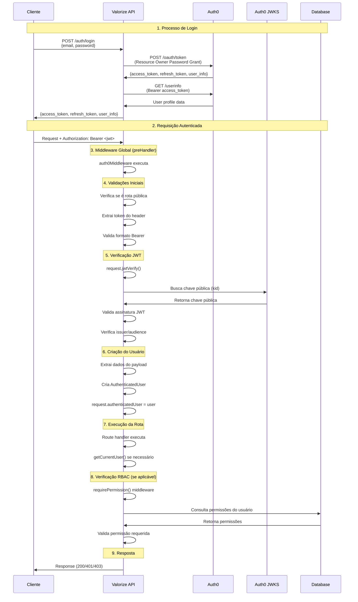

# Sistema de Autenticação - Valorize API

## Visão Geral

O sistema de autenticação da Valorize API utiliza **Auth0** como provedor de identidade e **JWT (JSON Web Tokens)** para autenticação stateless. O fluxo é implementado através de middlewares Fastify que processam automaticamente todas as requisições.

## Arquitetura

### Componentes Principais

1. **Auth0** - Provedor de identidade externo
2. **@fastify/jwt** - Plugin Fastify para validação JWT
3. **jwks-rsa** - Cliente para buscar chaves públicas Auth0
4. **auth0Middleware** - Middleware global de autenticação
5. **requirePermission** - Middleware RBAC para controle de acesso

## Fluxo de Autenticação



## Processo de Login Detalhado

### 1. Endpoint de Login (`POST /auth/login`)

```typescript
// Cliente envia credenciais para a API
POST /auth/login
{
  "email": "user@example.com",
  "password": "userpassword"
}
```

### 2. API processa login via Auth0

```typescript
// authService.login() executa:
const tokenResponse = await axios.post(
  `https://${auth0Domain}/oauth/token`,
  {
    grant_type: 'password',           // Resource Owner Password Grant
    username: credentials.email,
    password: credentials.password,
    client_id: clientId,
    client_secret: clientSecret,
    scope: 'openid profile email offline_access',
    audience: audience,
  }
)
```

### 3. Auth0 retorna tokens

```json
{
  "access_token": "eyJ0eXAiOiJKV1QiLCJhbGciOiJSUzI1NiIs...",
  "token_type": "Bearer",
  "expires_in": 86400,
  "refresh_token": "v1.M0_BQH2Og8cNMJd-A4E-yQWNXEi2...",
  "scope": "openid profile email offline_access"
}
```

### 4. API busca informações do usuário

```typescript
// Busca dados completos do usuário
const userInfo = await axios.get(
  `https://${auth0Domain}/userinfo`,
  {
    headers: { Authorization: `Bearer ${access_token}` }
  }
)
```

### 5. Resposta final para o cliente

```json
{
  "success": true,
  "data": {
    "access_token": "eyJ0eXAiOiJKV1QiLCJhbGciOiJSUzI1NiIs...",
    "token_type": "Bearer",
    "expires_in": 86400,
    "refresh_token": "v1.M0_BQH2Og8cNMJd-A4E-yQWNXEi2...",
    "scope": "openid profile email offline_access",
    "user_info": {
      "sub": "auth0|507f1f77bcf86cd799439011",
      "email": "user@example.com",
      "email_verified": true,
      "name": "John Doe",
      "avatar": "https://s.gravatar.com/avatar/..."
    }
  }
}
```

## Estrutura de Dados

### AuthenticatedUser Interface

```typescript
export interface AuthenticatedUser {
  sub: string              // Auth0 User ID (identificador único)
  email?: string           // Email do usuário
  email_verified?: boolean // Status de verificação do email
  name?: string           // Nome completo
  avatar?: string        // URL da foto de perfil
  [key: string]: unknown  // Outros campos do JWT payload
}
```

### Extensão do FastifyRequest

```typescript
declare module 'fastify' {
  interface FastifyRequest {
    authenticatedUser?: AuthenticatedUser
  }
}
```

## Configuração

### 1. Plugin JWT (@fastify/jwt)

```typescript
await app.register(jwt, {
  secret: async function (request: any, token: any) {
    const client = jwksClient({
      jwksUri: `https://${process.env.AUTH0_DOMAIN}/.well-known/jwks.json`,
      cache: true,           // Cache de chaves públicas
      cacheMaxEntries: 5,    // Máximo 5 chaves em cache
      cacheMaxAge: 600000,   // Cache por 10 minutos
    })
    
    // Extrai 'kid' do header JWT
    // Busca chave pública correspondente
    const key = await client.getSigningKey(kid)
    return key.getPublicKey()
  }
})
```

### 2. Registro do Middleware Global

```typescript
// Executa antes de todos os handlers de rota
app.addHook('preHandler', auth0Middleware)
```

### 3. Variáveis de Ambiente

```env
AUTH0_DOMAIN=your-domain.auth0.com
AUTH0_CLIENT_ID=your-client-id
AUTH0_CLIENT_SECRET=your-client-secret
AUTH0_AUDIENCE=your-api-identifier
AUTH0_SCOPE=openid profile email offline_access
```

## Middleware auth0Middleware

### Responsabilidades

1. **Filtrar rotas públicas** - Skip para `/health`, `/docs`, `/auth/login`, etc.
2. **Extrair token JWT** - Do header `Authorization: Bearer <token>`
3. **Validar formato** - Verificar se é um Bearer token válido
4. **Verificar assinatura** - Usando chaves públicas Auth0 (JWKS)
5. **Validar claims** - Issuer, audience, expiração
6. **Criar objeto user** - Extrair dados do payload JWT
7. **Anexar ao request** - `request.authenticatedUser = user`

### Rotas Públicas

```typescript
const PUBLIC_ROUTES = [
  '/health',
  '/docs',
  '/docs/static',
  '/docs/json',
  '/docs/yaml',
  '/auth/login',           // Endpoint de login
  '/auth/refresh',         // Renovação de token
  '/auth/refresh-info',    // Informações sobre refresh
]
```

## Funções Utilitárias

### getCurrentUser()

```typescript
export const getCurrentUser = (request: FastifyRequest): AuthenticatedUser => {
  if (!request.authenticatedUser) {
    throw new UnauthorizedError('User not authenticated')
  }
  return request.authenticatedUser
}
```

**Uso:**
- Garante que o usuário está autenticado
- Fornece type safety
- Lança erro se não autenticado

### isAuthenticated()

```typescript
export const isAuthenticated = (request: FastifyRequest): boolean => {
  return !!request.authenticatedUser
}
```

**Uso:**
- Verificação booleana simples
- Não lança erros

## Integração com RBAC

### Middleware requirePermission

```typescript
export const requirePermission = (permission: string) => {
  return async (request: FastifyRequest, _reply: FastifyReply) => {
    const user = getCurrentUser(request)  // Usa dados já processados
    
    const { allowed } = await rbacService.checkPermissionWithDetails(
      user.sub, 
      permission
    )
    
    if (!allowed) {
      throw new InsufficientPermissionError(permission, ...)
    }
  }
}
```

### Exemplo de Uso

```typescript
// Rota protegida por autenticação + permissão
fastify.get('/admin/users', {
  preHandler: requirePermission('admin:read_users')
}, async (request, reply) => {
  const user = getCurrentUser(request)
  // Lógica da rota...
})
```

## Renovação de Tokens

### Endpoint de Refresh (`POST /auth/refresh`)

```typescript
POST /auth/refresh
{
  "refresh_token": "v1.M0_BQH2Og8cNMJd-A4E-yQWNXEi2..."
}
```

### Processo de Renovação

1. **Cliente envia refresh_token** para `/auth/refresh`
2. **API valida o refresh_token** com Auth0
3. **Auth0 retorna novo access_token** (e possivelmente novo refresh_token)
4. **API retorna tokens atualizados** para o cliente

```typescript
// authService.refreshToken() executa:
const refreshResponse = await axios.post(
  `https://${auth0Domain}/oauth/token`,
  {
    grant_type: 'refresh_token',
    client_id: clientId,
    client_secret: clientSecret,
    refresh_token: refreshToken,
    audience: audience,
  }
)
```

## Verificação de Sessão

### Endpoint de Verificação (`GET /auth/verify`)

```typescript
GET /auth/verify?minimal=true
Authorization: Bearer <jwt_token>
```

### Modos de Verificação

#### 1. Modo Minimal (`?minimal=true`)
- Validação básica do token (estrutura e expiração)
- Não requer middleware de autenticação
- Mais rápido e eficiente

#### 2. Modo Completo (padrão)
- Validação completa via middleware
- Informações detalhadas da sessão
- Dados completos do usuário

## Tratamento de Erros

### Tipos de Erro

1. **UnauthorizedError** - Token ausente, inválido ou expirado
2. **InsufficientPermissionError** - Usuário sem permissão necessária

### Códigos de Erro JWT

```typescript
// Mapeamento de erros do @fastify/jwt
if (errorCode === 'FST_JWT_AUTHORIZATION_TOKEN_EXPIRED') {
  throw new UnauthorizedError('Token has expired')
}

if (errorCode === 'FST_JWT_AUTHORIZATION_TOKEN_INVALID') {
  throw new UnauthorizedError('Invalid token')
}
```

### Erros de Login

```typescript
// Erros do Auth0 durante login
if (authError?.error === 'invalid_grant') {
  throw new Error('Invalid email or password')
}

if (authError?.error === 'access_denied') {
  throw new Error('Access denied')
}
```

## Segurança

### Validações Implementadas

1. **Formato do Token** - Deve ser `Bearer <jwt>`
2. **Assinatura JWT** - Verificada com chaves públicas Auth0
3. **Issuer** - Deve corresponder ao domínio Auth0 configurado
4. **Audience** - Validado se configurado (opcional)
5. **Expiração** - Verificada automaticamente pelo plugin JWT

### Cache de Chaves JWKS

- **Cache habilitado** para chaves públicas Auth0
- **TTL de 10 minutos** para reduzir latência
- **Máximo 5 chaves** em cache simultâneo

### Resource Owner Password Grant

- **Grant type seguro** para aplicações confiáveis
- **Client secret** obrigatório para validação
- **Scope limitado** conforme configuração

## Performance

### Otimizações Existentes

1. **Cache JWKS** - Evita buscar chaves públicas repetidamente
2. **Skip rotas públicas** - Não processa autenticação desnecessariamente
3. **Skip OPTIONS** - Ignora requests CORS preflight
4. **Cache de user info** - Informações do usuário obtidas apenas no login

### Métricas Típicas

- **Rota pública**: ~0.1ms (apenas verificação de rota)
- **Login completo**: ~200-500ms (Auth0 + userinfo)
- **Primeira validação JWT**: ~5-10ms (busca chave JWKS)
- **Validações subsequentes**: ~2-3ms (chave em cache)

## Exemplo Completo de Uso

### 1. Login do Cliente

```javascript
// Frontend - Login
const response = await fetch('/auth/login', {
  method: 'POST',
  headers: { 'Content-Type': 'application/json' },
  body: JSON.stringify({
    email: 'user@example.com',
    password: 'userpassword'
  })
})

const { data } = await response.json()
const { access_token, refresh_token } = data

// Armazenar tokens (localStorage, sessionStorage, etc.)
localStorage.setItem('access_token', access_token)
localStorage.setItem('refresh_token', refresh_token)
```

### 2. Requisições Autenticadas

```javascript
// Frontend - Requisições subsequentes
const token = localStorage.getItem('access_token')

const response = await fetch('/users/profile', {
  headers: {
    'Authorization': `Bearer ${token}`
  }
})
```

### 3. Processamento na API

```typescript
// Backend - Route handler
app.get('/users/profile', async (request, reply) => {
  // auth0Middleware já executou e populou request.authenticatedUser
  const user = getCurrentUser(request)  // Dados já disponíveis
  
  return {
    profile: {
      id: user.sub,
      email: user.email,
      name: user.name,
      avatar: user.avatar
    }
  }
})
```

### 4. Renovação de Token

```javascript
// Frontend - Renovar token quando necessário
const refreshToken = localStorage.getItem('refresh_token')

const response = await fetch('/auth/refresh', {
  method: 'POST',
  headers: { 'Content-Type': 'application/json' },
  body: JSON.stringify({
    refresh_token: refreshToken
  })
})

const { data } = await response.json()
localStorage.setItem('access_token', data.access_token)
```

## Troubleshooting

### Problemas Comuns

1. **Token expirado** - Cliente deve renovar via `/auth/refresh`
2. **Issuer inválido** - Verificar `AUTH0_DOMAIN`
3. **Chave JWKS não encontrada** - Verificar conectividade com Auth0
4. **Audience inválido** - Verificar `AUTH0_AUDIENCE` (se configurado)
5. **Credenciais inválidas** - Verificar email/senha no Auth0
6. **Client secret incorreto** - Verificar `AUTH0_CLIENT_SECRET`

### Logs Úteis

```typescript
// Debug de login
logger.info('Auth0 login successful', {
  email: credentials.email,
  tokenType: tokenData.token_type,
  expiresIn: tokenData.expires_in,
  hasRefreshToken: !!tokenData.refresh_token,
})

// Debug de autenticação
logger.debug('User authenticated successfully', {
  userId: user.sub,
  email: user.email,
  url: request.url
})

// Warnings de falha
logger.warn('JWT verification failed', {
  error: error.message,
  url: request.url
})
```

### Monitoramento

```typescript
// Métricas importantes para monitorar:
// - Taxa de sucesso de login
// - Tempo de resposta do Auth0
// - Cache hit rate do JWKS
// - Frequência de refresh de tokens
// - Erros de validação JWT
```

---

**Nota**: Este sistema implementa autenticação stateless, escalável e segura, utilizando o padrão Resource Owner Password Grant do OAuth 2.0 através do Auth0, com integração completa ao sistema RBAC para controle granular de permissões.
